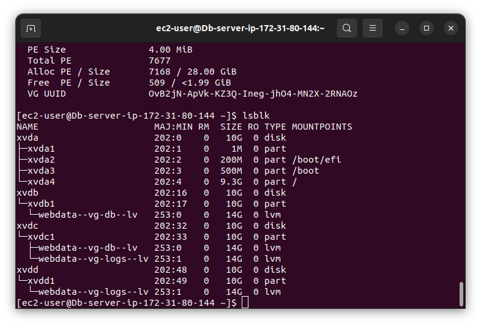

# Project-6-Three-Tier-Architecture
>># **Web Solution with wordpress**

### 1. Project Description 
    This project consists of two parts
    1. The first part was to configure a storage subsystem for web and database servers based on Linux OS (Redhat). The volumes were partitioned accordingly using gdisk.    
    2. The second part was to install wordpress and connect it to a remote MySQL database server.

### 2. The set-up was done using AWS-Virtual machines, 2 VMs was provisioned, 1 for the database and 1 for the web server. A pc was then used for the client.
    The Setup 
    I. A Laptop to serve as client 
    II. An Ec2 linux server for the web-server (To install wordpress)
    III. An EC2 linux server (Database server)

>## Project in Details

### 3. Server Configuration
    I. Launch EC2 machine and attach 3 volumes of 10gb in the same AZ
    II. Used lsblk command to list the available storage attached to the VM
    III. used df -h command to see all mount points and free space on the volumess created
4. **ls/dev command output**

5. **lsblk command output**

### 6. Using gdisk utitlity to create a single partition on each of the 3 volumes created and pvcreate to create physical volumes
    I. sudo gdisk /dev/xvdb
    II. sudo gdisk /dev/xvdc
    III. sudo gdisk /dev/xvdf
    IV. sudo pvcreate /dev/xvdb 
    V. sudo pvcreate /dev/xvdc 
    VI. sudo pvcreate /dev/xvdf

6. using **lsblk** to see created partitions and **pvcreate** to create physical volumes to be used by the LVM

7. created a volume group with **sudo vgcreate** utility and named it as webdata-vg **(sudo vgcreate webdata-vg /dev/xvdb /dev/xvdc /dev/xvdf)**

8. used the **sudo lvcreate** utility to create logical volumes **(sudo lvcreate -n apps-lv -L 14GB webdata-vg)**, **(sudo lvcreate -n logs-lv -L 14GB webdata-vg)**

9. verified the setup by running **(sudo lsblk)**

10. used ext4 file system to format the logical volumes **(sudo mkfs -t ext4 /dev/webdata-vg/apps-lv)** 

11. created directories to store website files and log data

12. Mounting directory for logical volume 

13. updating fstab file in **/etc/fstab** so mount configurations will persist after server restarts 

14. checking to make sure the setup is up and running 

15. configuring DB-Instance(creting partitions) 

16. Verifying DB-setup

17. Installing wordpress on webserver 
    I. updated the repository with **sudo yum update -y** 
    ii. installed wget, apache and its dependencies **(sudo yum -y install wget httpd php php-mysqlnd php-fpm php-json)**

    iii. istalled php and its dependencies 

    iv. Downloaded wordpress and copied its files to the /var/www/html/ directory 

18. Configuring SELinux policies
    sudo chown -R apache:apache /var/www/html/wordpress

    sudo chcon -t httpd_sys_rw_content_t /var/www/html/wordpress -R
    sudo setsebool -P httpd_can_network_connect=1

19. installing MySQL on the db-server
    sudo yum update
    sudo yum install mysql-server

20. checking the mysql service is running by running **(sudo systemctl status mysqld)**

21. Confguring Database to work with wordpress 
    sudo mysql
    CREATE DATABASE wordpress;
    CREATE USER `myuser`@`<Web-Server-Private-IP-Address>` IDENTIFIED BY 'mypass';

    GRANT ALL ON wordpress.* TO 'myuser'@'<Web-Server-Private-IP-Address>';
    FLUSH PRIVILEGES;

    SHOW DATABASES;
    exit

22. successfully connected to Db server from webserver

23. Wordpress Welcome Page 

